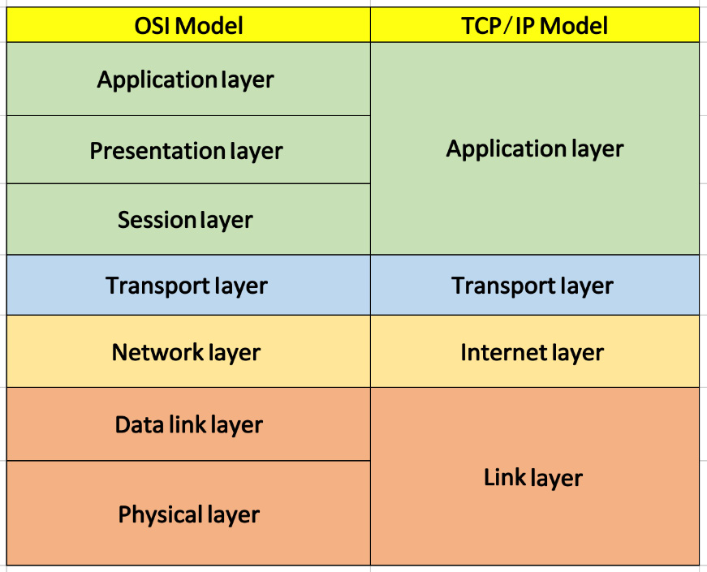

# Network-security-note

## Computer Networking

> [!NOTE]
>
> OSI (7 Layer) and TCP/IP model

* Application Layer
  * HTTP
  * FTP
  * SMTP, POP3, IMAP
  * DNS
  * ...

* Presentation Layer
  * SSL
  * TLS
  * JPEG
  * ...
* Session Layer
  *... 

* Transport Layer
  * TCP
  * UDP
* Network Layer
  * IP
  * ARP
  * ICMP
  * IPSec
* Link Layer
  * PPP
  * Ethernet
### Summary

### References 
* https://blog.smartbuildingsacademy.com/what-is-the-osi-model
* Computer Networking: A Top Down Approach
### Practice
[Practice here ...]()

## Swiching and Routing (Network and System Adminstration)
> [!NOTE]
>
> Focus on Swiching and Routing Protocol
>
> Basic services in enterprise network (DNS, DHCP, ...)

* IPv4/IPv6
* Routing/Routing Protocol
* ACL
* NAT
* Switch
* STP
* VLAN
* DNS
* DHCP
* AD
* Active Directory and Group Policy 
*	File Server and Web Server 
*	Virtualization 
*	Container 
*	Cloud 

### Summary 

### References 
* CCNA volume 1/2
* https://itexamanswers.net/
### Practice

[Practice cisco lab - Packet tracer]()

* Services deploy in Linux
* Services deploy in Windows

## Network Security
> [!NOTE]
>
> Focus on network security protocol
>
> Cryptography, PKI, ...

* Modern Network Security Threats
* Securing Network Devices
* Authentication, Authorization, and Accounting
* Firewall Technologies
* Intrusion Prevention
* Securing the Local Area Network
* Cryptographic Systems
* Virtual Private Networks
* Cisco Adaptive Security Appliance (ASA)
* Managing a Secure Network

* MAC_ARP
* IP_ICMP
* Sniffing and Spoofing
* UDP
* TCP
* Firewall
* VPN
* DNS
* Tunneling
* DNSSEC
* BGP
* Heartbleed
* Reverse Shell
* Packet Sniffing Spoofing
* TCP Attack
* DNS Attack

### Summary 

### References 

### Practices
* Seed Lab

## Network Security Solution/Architecture
> [!NOTE]
>
> Standards for implement network security in enterprise
>
> Solution/Architecture

* Software-defined storage - Ceph
* OpenShift
* OpenStack
* ELK Stacks
* KVM
* Redis - MySQL
* Snort - IDS
* OSSEC - IDS
* PfSense
* SIEM
* OpenVAS
* OpenVPN
* WSUS
* Suid
* K8s+security
* KVM
* Cuckoo Sandbox
* Proxy+WAF
* DBF 
* NGFW 
* WAF
* NIPS 
* Database Security 
* Next Gen Threat Prevention 
* Endpoint Security 
* AMP 
* SIEM 
* Protocol Security 
* Steganography

## Network Penetration Testing

> [!NOTE]
>
> Network penetration testing phrases
>
> Network penetration testing tool 
>
> Attack network/ network protocol techniques
>
> ...

### Network Security Strategies
- [ ] Top Network Threat
- [ ] Network Penetration Testing
- [ ] Network Attack
- [ ] Network Digital Forensics
- [ ] Network Audit
- [ ] Threat Management
- [ ] Vulnerability Assessments

### Network Penetration Testing 

- [ ] Pre-engagement
- [ ] Reconnaissance
- [ ] Threat modeling
- [ ] Exploitation
- [ ] Post-exploitation
- [ ] Reporting
- [ ] Retesting

## Network Defense

## Network Monitoring

## Threat Intelligence

> [!NOTE]
>
> Threat Intelligence
>
> Practice Threat Intelligence
>
> Techiques, ...

## Zero Trusts Networks

## Projects 
* Socket programming projects
    * Create client and server
    * Message exchanges
* 